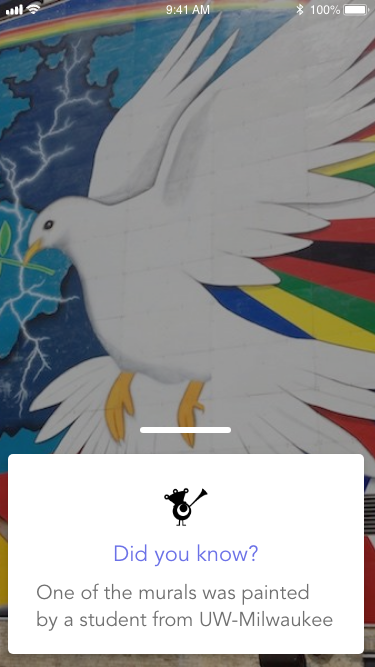

# VisualEyes's Discover Lens

VisualEyes features an interactive AR World where users can view their communities, information on different locations and interact with information and objects around it. 

This app is a collaboration between VisualEyes, Milwaukee Mural Organization and gAlpha Accelerator program.

# What it does

When user launches the app, VisualEyes will convert the user's surrounding into an augmented reality world and populate them with hidden interests in AR form!

Users can:
- Interact with any information on the screen 
information based on interest. For example, receiving information on murals, getting directions

- Receive an advertisement in 3D form / learn more about details of a hidden interest

As well as taking a picture with the murals!

## Comparative Advantage

VisualEyes provides current specific live event map and current schedule to the user when user is at the local event.

What we are offering here at VisualEyes is the ability to enhance the interactivity of displayed information and the visual viewing experience for people in a particular local community, with the use of AR technology. The target market that we are looking to penetrate for now is event organizers, city developers, as well as citizens/tourists. The mobile app which is required to be downloaded is easy and simple to use as the user would only need to point the camera to the surrounding and interact with the information with the help the AR visuals. The AR visuals will be interactive and increase user participation in the local community and provide an interactive way to approach inforation (“info-raction”, short for interaction information).

